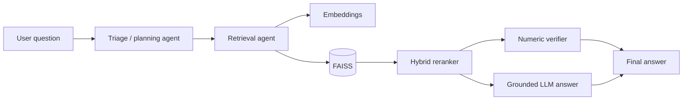

# Agentic RAG Chatbot for Financial Statements

An **agentic Retrieval-Augmented Generation (RAG)** portfolio project for question answering over multi-year financial statements. The system combines LLM-based planning, FAISS semantic retrieval, hybrid reranking, and deterministic numeric verification to improve grounding for finance-oriented questions.

> **Portfolio note:** This is a sanitized portfolio version of work developed during an AI internship. It demonstrates the architecture and implementation without publishing confidential data, source documents, generated embeddings, or credentials. It is not an official product of any employer or financial institution.

## Core capabilities

- Agentic question triage and planning
- Retrieval-Augmented Generation (RAG)
- OpenAI embeddings + FAISS vector search
- Hybrid reranking using semantic and keyword signals
- Deterministic verification for numeric financial metrics
- Table-like year/value extraction heuristics
- Grounded LLM answering for descriptive questions
- Streamlit conversational interface

## Architecture



See [`docs/ARCHITECTURE.md`](docs/ARCHITECTURE.md) for more detail.

## Tech stack

- **Python 3.9+**
- **OpenAI Agents SDK**
- **OpenAI API**
- **Embeddings:** `text-embedding-3-large`
- **Vector search:** FAISS
- **UI:** Streamlit
- **Testing / CI:** pytest + GitHub Actions

## Repository structure

```text
.
├── src/
│   ├── agents/
│   ├── app/
│   ├── artifacts/       # generated locally; not committed
│   ├── pipeline/
│   ├── rag_engine/
│   └── config.py
├── data/                # local processing workspace; data excluded
├── docs/
│   └── ARCHITECTURE.md
├── tests/
├── .env.example
└── requirements.txt
```

## Quick start

```bash
git clone <your-repository-url>
cd agentic-rag-financial-chatbot
python -m venv .venv
pip install -r requirements.txt
```

Set your API key locally:

```bash
OPENAI_API_KEY=your_openai_api_key_here
```

Never commit a real API key.

## Preparing data and rebuilding the index

The public repository intentionally excludes source documents, OCR text, chunks, and embedding artifacts.

Prepare financial-statement text that you are permitted to process, then run the pipeline from the repository root:

```bash
python -m src.pipeline.clean_ocr
python -m src.pipeline.split_all_years
python -m src.pipeline.chunk_all_years
python -m src.pipeline.merge_chunks
python -m src.pipeline.embed_chunks
```

The embedding step creates:

- `src/artifacts/faiss.index`
- `src/artifacts/faiss_metadata.json`

It requires a valid `OPENAI_API_KEY`.

## Run the app

After rebuilding the local index:

```bash
streamlit run src/app/app.py
```

## Example questions

- `What is the net profit attributable to shareholders in 2024?`
- `Compare total assets in 2023 and 2024.`
- `What is the earnings per share (EPS) in 2022?`
- `Summarize key changes in performance in 2024.`

## Retrieval design

The retrieval stage uses a **wide → rerank → narrow** pattern:

1. Embed the user question.
2. Retrieve a wider candidate set from FAISS.
3. Combine semantic similarity with keyword/metric signals.
4. Keep the strongest chunks.
5. Pass only focused evidence downstream.

## Numeric safety

For numeric questions, the system does not rely solely on generative output. It applies deterministic extraction and sanity checks, with year-aware heuristics where possible. When evidence is insufficient, the system is designed to avoid inventing a value.

## Tests

```bash
pip install -r requirements-dev.txt
pytest -q
```

## Security and data handling

- No API keys are stored in the repository.
- `.env` files are ignored.
- Raw documents, OCR text, extracted chunks, and generated vector-store artifacts are excluded.
- The repository is intended to demonstrate engineering approach, not redistribute internship or employer data.

## Author

**Sami Samardali**  
Artificial Intelligence graduate — University of Jordan
