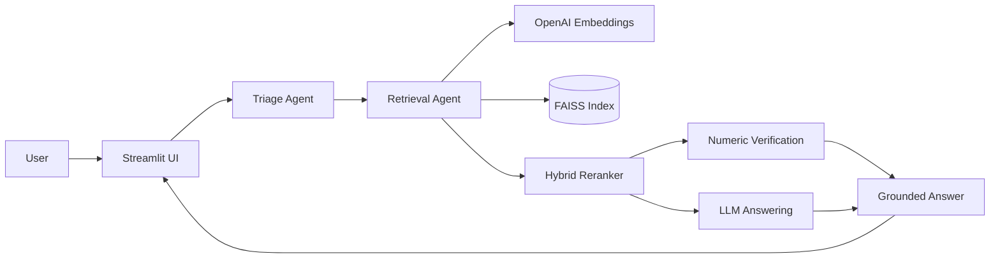

# Architecture

## Runtime flow

1. **Triage / planning** — classifies the question as numeric, comparison, or descriptive and extracts target years/metrics.
2. **Retrieval** — embeds the user query, performs a wide FAISS vector search, and reranks candidate chunks with lexical boosts.
3. **Verification** — numeric answers are checked using deterministic regex and table-oriented heuristics before being returned.
4. **Grounded generation** — descriptive answers use the LLM only with retrieved evidence.
5. **UI** — Streamlit provides a lightweight conversational interface.

## Key design choices

- **Wide-to-narrow retrieval:** retrieve many candidates first, then rerank and truncate to keep context focused.
- **Hybrid relevance:** combine vector similarity with keyword/metric boosts for financial queries.
- **Deterministic numeric checks:** reduce hallucination risk by verifying values against retrieved text before surfacing them.
- **Separation of concerns:** planning, retrieval, verification, answering, and UI live in separate modules.

## Portfolio scope

This repository is a sanitized portfolio version. Raw statement PDFs and OCR intermediates are excluded from version control. The included runtime artifacts are based on public annual financial statement content and are provided to make the demo structure inspectable.
